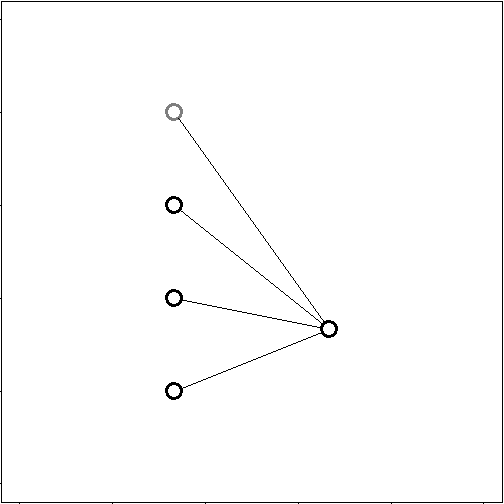
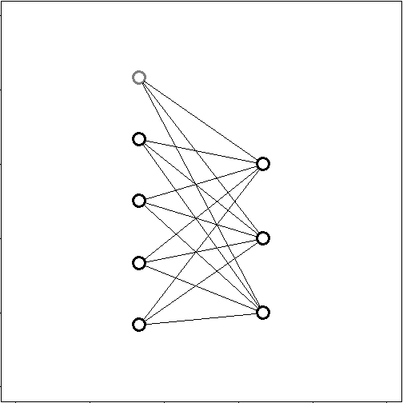
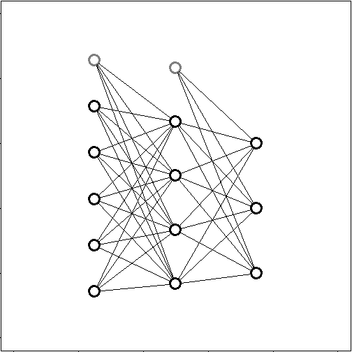

## Logistic Regression

* A logistic regression is used to classify between two outputs A and B or 0 and 1.
* Here we see a representation of a logistic regression with 3 inputs and a classification type ouput.

--- .class #id 

## Multiclass logistic regression

* A multiclass logistic regression is used when we have to classify between multiple outputs.
* Here we see such a regression's representation with 4 inputs and 3 classification ouputs.

--- .class #id 

## Neural Network

* A neural Network can be thought of stacked multiclass logistic regression.
* The below NN can be thought of as 2 stacked multiclass logistic regression, with the ouputs of the first serving as the inputs to the next.

--- .class #id 

## Thanks

* If you liked this intro go through Andrew Ng's course in coursera.org.
* Thanks.

--- .class #id 
